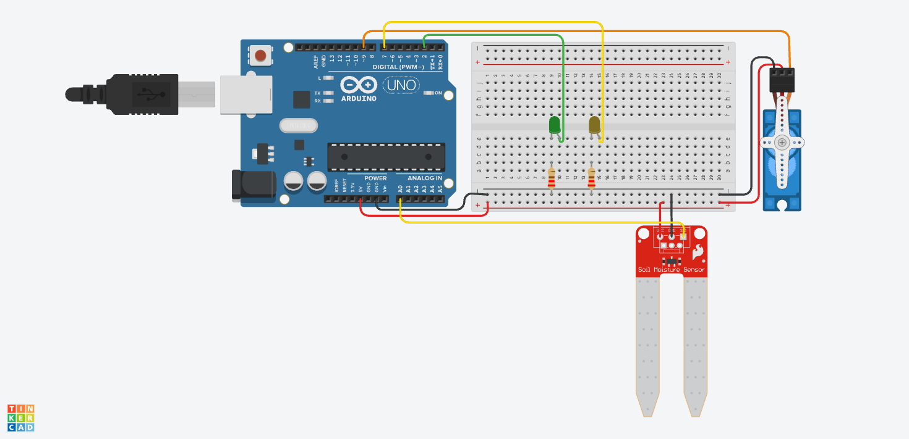

# Sistema de Irrigação Inteligente

> **Projeto Prático de Sistemas Embarcados (Arduino Uno)**
> _Controle autônomo de irrigação com sensor de umidade do solo e servomotor para abertura e fechamento de registro d'água até atingir 80% de umidade._

## Contexto Acadêmico

Este repositório contém a solução desenvolvida para a **atividade prática proposta pelo professor**. O objetivo do exercício foi criar um sistema de irrigação inteligente utilizando o simulador **Tinkercad**, consolidando os seguintes conceitos obrigatórios da disciplina:

- Leitura de entradas analógicas (Sensor de Umidade do Solo).
- Controle de servomotor via biblioteca oficial (`Servo.h`) para movimentação mecânica de registro de água.
- Modularização do código-fonte em funções bem definidas e de responsabilidade única para estruturar o programa.
- **Desafio Técnico:** Implementação de controle de estabilidade mecânica com histerese operacional para prevenir trepidação (*chattering*) do servomotor ao redor do limiar de 80%.

## 1. O Problema e o Contexto Operacional

A agricultura de precisão e o manejo sustentável de áreas verdes exigem controle rigoroso da lâmina d'água aplicada ao solo. O déficit hídrico prejudica o desenvolvimento das culturas vegetais, enquanto o excesso de irrigação causa desperdício de água, lixiviação de nutrientes e degradação radicular por anoxia.

Este projeto fornece uma camada de controle automatizada, capaz de aferir continuamente o teor de água no substrato através de um sensor analógico de umidade do solo. Quando o solo se encontra abaixo da meta estipulada (< 80%), o sistema abre o registro de água acionando um servomotor em 90°, mantendo a irrigação ativa até que a umidade atinja 80%, momento no qual o servomotor fecha o registro (0°) e os LEDs na bancada atualizam a sinalização de estado do sistema.

## 2. Matriz de Estados e Regras de Disparo

A classificação da umidade do solo lida pelo sensor rege o comportamento dos atuadores mecânicos e visuais de forma determinística:

| Condição de Umidade   | Faixa Percentual                     | Estado do Sistema | Registro d'Água (Servo D9) | LED Verde (D2) | LED Amarelo (D7) | Fluxo de Água |
| --------------------- | ------------------------------------ | ----------------- | -------------------------- | -------------- | ---------------- | ------------- |
| **Solo Seco**         | $< 78.0\%$                           | `IRRIGANDO`       | **ABERTO (90°)**           | Desligado      | **LIGADO**       | **Liberado**  |
| **Zona de Histerese** | $78.0\% \le \text{Umidade} < 80.0\%$ | Transição         | Mantém estado anterior     | Mantém         | Mantém           | Mantém        |
| **Solo Adequado**     | $\ge 80.0\%$                         | `NORMAL`          | **FECHADO (0°)**           | **LIGADO**     | Desligado        | **Bloqueado** |

> [!NOTE]
> **Controle de Estabilidade Mecânica (Histerese Operacional):** Próximo ao ponto de corte de 80.0%, pequenas variações no sinal elétrico analógico poderiam acionar e desarmar o servomotor repetidamente em frações de segundo. A aplicação de uma banda de histerese de 2.0% garante que o registro só seja reaberto se a umidade cair abaixo de 78.0%, protegendo as engrenagens do atuador contra desgaste prematuro e prevenindo pulsos hidráulicos contínuos na tubulação.

## 3. O Desafio Técnico: Controle Mecânico com Histerese

Para garantir a operação contínua sem oscilação rápida entre os estados ligado e desligado, o sistema implementa uma máquina de estados com banda de histerese centrada na meta de 80% requerida pela atividade.

O servomotor foi conectado ao pino digital **D9 (`~9`)**, provido de temporizador de hardware e pulsos de posicionamento angular via biblioteca `<Servo.h>`. O estado da irrigação dita o ângulo aplicado:

- **Critério de Abertura:** Quando a umidade lida for inferior a 78.0%, o servomotor comuta para 90°, liberando a passagem de água:

$$\text{Irrigação Ativa} \iff \text{Umidade} < 78.0\%$$

- **Critério de Manutenção e Corte:** Enquanto o solo estiver sendo molhado, a válvula permanece aberta até que a umidade alcance o limiar estipulado de 80.0%:

$$\text{Corte do Fluxo} \iff \text{Umidade} \ge 80.0\%$$

- **Transição Límpida de Estados:** Entre 78.0% e 80.0%, o sistema preserva o estado anterior, impedindo que ruídos na leitura analógica forcem manobras excessivas no eixo do motor. Ao atingir 80.0%, o registro comuta para 0° e o LED verde acende indicando conformidade.

## 4. Pinout e Conexões do Circuito (Hardware)

O circuito foi projetado para o **Arduino Uno R3**, mantendo o mapeamento direto e padronizado:

| Componente                    | Pino Arduino | Tipo de I/O         | Função no Sistema                            | Montagem Tinkercad                    |
| ----------------------------- | ------------ | ------------------- | -------------------------------------------- | ------------------------------------- |
| **Sensor de Umidade do Solo** | `A0`         | Entrada Analógica   | Leitura de Umidade do Substrato              | Terminais em 5V, GND e Sinal no A0    |
| **Micro Servomotor (SG90)**   | `D9 (~)`     | Saída Digital/PWM   | Válvula / Registro de Água                   | Alimentação em 5V, GND e Sinal no D9  |
| **LED Verde**                 | `D2`         | Saída Digital       | Operação Normal / Solo Adequado ($\ge 80\%$) | Resistor limitador de 220 Ω no cátodo |
| **LED Amarelo**               | `D7`         | Saída Digital       | Estado de Irrigação Ativa ($< 80\%$)         | Resistor limitador de 220 Ω no cátodo |

### 4.1. Diagrama do Circuito no Tinkercad

Abaixo está a montagem física na protoboard desenvolvida no Autodesk Tinkercad, demonstrando as conexões do sensor de solo e dos atuadores:

> [!TIP]
> Durante a simulação no Tinkercad, clicar sobre o sensor de umidade do solo abre a barra deslizante (_slider_), permitindo variar a umidade e observar o servomotor comutando entre 0° e 90° conforme os limiares operacionais são cruzados.
